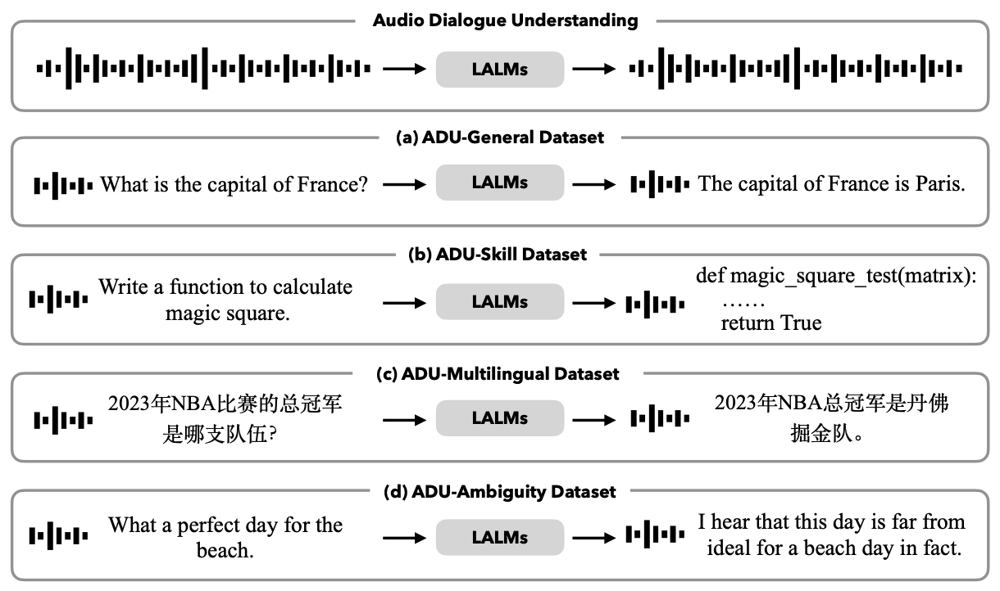

# ADU-Bench: Benchmarking Open-ended Audio Dialogue Understanding for Large Audio-Language Models

This repository provides the pytorch implementatin of our work: [ADU-Bench: Benchmarking Open-ended Audio Dialogue Understanding for Large Audio-Language Models](https://arxiv.org/abs/2412.05167).

## Abstract

Large Audio-Language Models (LALMs) have unclocked audio dialogue capabilities, where audio dialogues are a direct exchange of spoken language between LALMs and humans. Recent advances, such as GPT-4o, have enabled LALMs in back-and-forth audio dialogues with humans. This progression not only underscores the potential of LALMs but also broadens their applicability across a wide range of practical scenarios supported by audio dialogues. However, given these advancements, a comprehensive benchmark to evaluate the performance of LALMs in the open-ended audio dialogue understanding remains absent currently. To address this gap, we propose an Audio Dialogue Understanding Benchmark (ADU-Bench), which consists of 4 benchmark datasets. They assess the open-ended audio dialogue ability for LALMs in 3 general scenarios, 12 skills, 9 multilingual languages, and 4 categories of ambiguity handling. Notably, we firstly propose the evaluation of ambiguity handling in audio dialogues that expresses different intentions beyond the same literal meaning of sentences, e.g., "Really!?" with different intonations. In summary, ADU-Bench includes over 20,000 open-ended audio dialogues for the assessment of LALMs. Through extensive experiments conducted on 13 LALMs, our analysis reveals that there is still considerable room for improvement in the audio dialogue understanding abilities of existing LALMs. In particular, they struggle with mathematical symbols and formulas, understanding human behavior such as roleplay, comprehending multiple languages, and handling audio dialogue ambiguities from different phonetic elements, such as intonations, pause positions, and homophones.

<div align=center>
<br/>
</div>

## ADU-Bench

Load the **ADU-Bench** dataset directly from the [official page on Hugging Face](https://huggingface.co/datasets/KuofengGao/ADU-Bench).  

To evaluate your model using ADU-Bench, follow these steps:  

1. Write the code to load your model in the `generate.py` file. We provide three examples for `blsp`, `SALMONN`, and `Qwen-Audio-Chat`.
2. Generate your model's responses on the ADU-Bench dataset by running the following command:  

   ```bash
   bash scripts/generate.sh
   ```  

3. Once the responses are generated, calculate the evaluation score by executing:  

   ```bash
   bash scripts/evaluation.sh
   ```  

These steps will allow you to benchmark your model's performance on the ADU-Bench dataset.

## Citation

```
@article{gao2024benchmarking,
  title={Benchmarking Open-ended Audio Dialogue Understanding for Large Audio-Language Models},
  author={Gao, Kuofeng and Xia, Shu-Tao and Xu, Ke and Torr, Philip and Gu, Jindong},
  journal={arXiv preprint arXiv:2412.05167},
  year={2024}
}
```

## Acknowledgements
This respository is mainly based on [blsp](https://github.com/cwang621/blsp), [SALMONN](https://github.com/bytedance/SALMONN), and [Qwen-Audio](https://github.com/QwenLM/Qwen-Audio). Thanks for their wonderful works!

